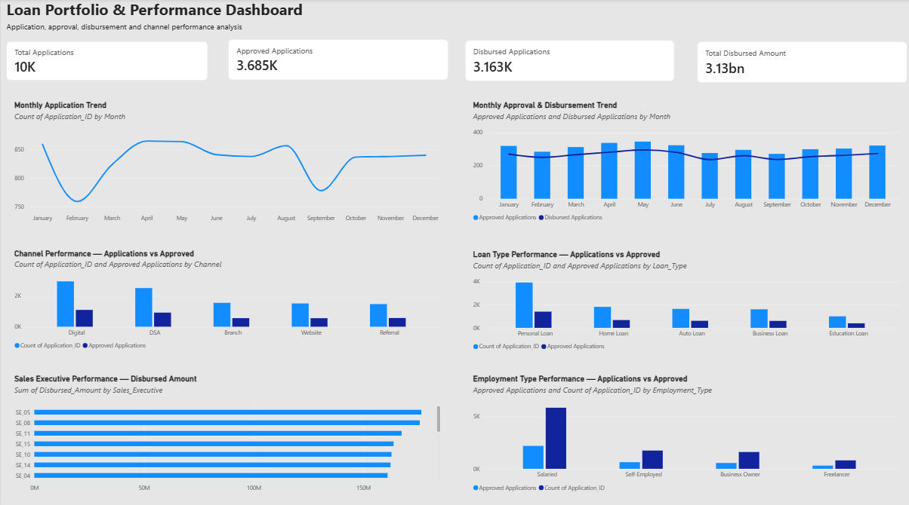
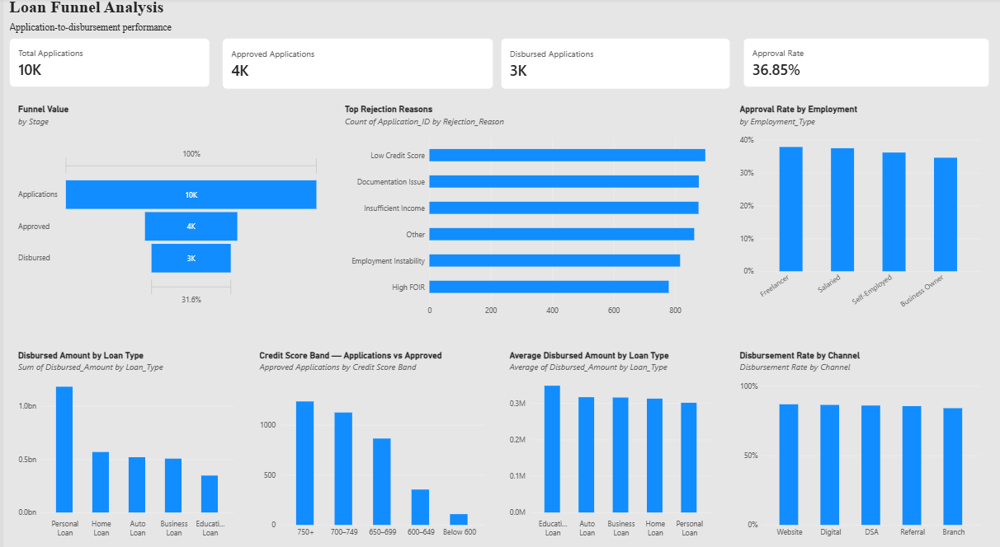
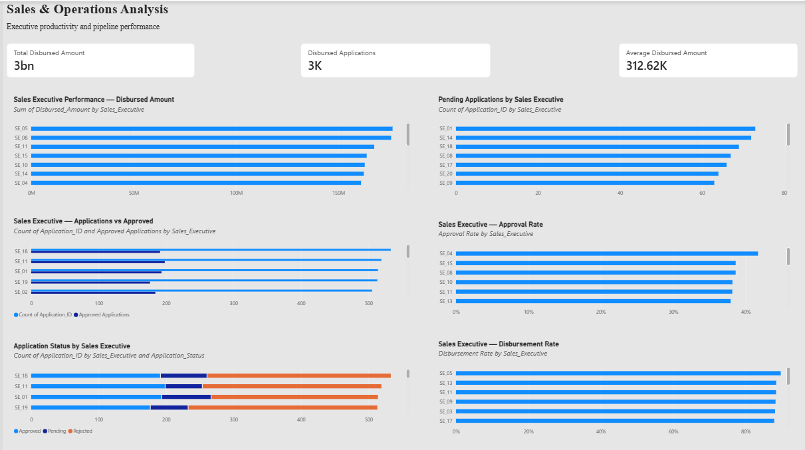

# FinTech Loan Analytics Dashboard

## 📌 Project Overview

An interactive **Power BI dashboard** designed to analyze loan applications, approvals, disbursements, loan types, channels, employment segments, and sales executive performance.

The project transforms loan application data into actionable business insights through KPI analysis, trend analysis, funnel analysis, segmentation, and interactive visual reporting.

---

## 🎯 Business Objectives

- Monitor overall loan application, approval, and disbursement performance
- Analyze monthly application, approval, and disbursement trends
- Evaluate loan performance across different loan types
- Compare application and approval performance across acquisition channels
- Analyze approval rates across employment segments
- Identify major loan rejection reasons
- Evaluate sales executive productivity and performance
- Analyze pending, approved, rejected, and disbursed applications
- Support data-driven decision-making through interactive dashboards

---

## 🛠️ Tools & Technologies

- **Microsoft Power BI**
- **Power Query**
- **DAX**
- **Microsoft Excel**
- **Data Visualization**
- **Business Intelligence**

---

## 📊 Dashboard Structure

The project contains three interactive dashboard pages:

### 1. Executive Overview

Provides a high-level view of the overall loan portfolio and business performance.

**Key KPIs:**
- Total Applications
- Approved Applications
- Disbursed Applications
- Total Disbursed Amount

**Analysis includes:**
- Monthly Application Trend
- Monthly Approval & Disbursement Trend
- Channel Performance
- Loan Type Performance
- Sales Executive Disbursement Performance
- Employment Type Performance

---

### 2. Loan Funnel Analysis

Focuses on the movement of applications through the loan approval and disbursement funnel.

**Key KPIs:**
- Total Applications
- Approved Applications
- Disbursed Applications
- Approval Rate

**Analysis includes:**
- Application → Approval → Disbursement Funnel
- Top Loan Rejection Reasons
- Approval Rate by Employment Type
- Disbursed Amount by Loan Type
- Approved Applications by Credit Score Band
- Average Disbursed Amount by Loan Type
- Disbursement Rate by Channel

---

### 3. Sales & Operations Analysis

Evaluates sales executive productivity and operational pipeline performance.

**Key KPIs:**
- Total Disbursed Amount
- Disbursed Applications
- Average Disbursed Amount

**Analysis includes:**
- Sales Executive Disbursed Amount
- Pending Applications by Sales Executive
- Sales Executive Applications vs Approved Applications
- Sales Executive Approval Rate
- Application Status by Sales Executive
- Sales Executive Disbursement Rate

---

## 💡 Key Business Insights

The dashboard enables analysis of:

- Application and approval trends over time
- Conversion from applications to approvals and disbursements
- Performance differences across loan products
- Channel-level application and approval performance
- Credit-score-based approval patterns
- Common reasons for loan rejection
- Employment-type approval patterns
- Sales executive productivity
- Pending and rejected application volumes
- Disbursement performance across channels and loan types

---

## 📈 Key Skills Demonstrated

- Data Cleaning & Transformation
- Power Query
- Data Modeling
- DAX Calculations
- KPI Development
- Trend Analysis
- Loan Funnel Analysis
- Business Segmentation
- Performance Analysis
- Interactive Dashboard Development
- Data Visualization
- Business Insight Generation

---

## 📂 Project Files

- `Fintech_Loan_Analytics.pbix` — Power BI dashboard file
- `01_Executive_Overview.png` — Executive Overview dashboard preview
- `02_Loan_Funnel_Analysis.png` — Loan Funnel Analysis dashboard preview
- `03_Sales_Operations_Analysis.png` — Sales & Operations Analysis dashboard preview

---

## 📷 Dashboard Preview

### Executive Overview

### Loan Funnel Analysis

### Sales & Operations Analysis

---

## 👩‍💻 Author

**Meghana P**

Business & Data Analytics | Power BI | SQL | Excel | Tableau
