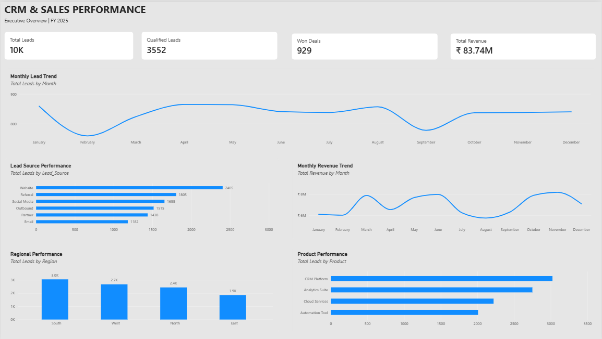
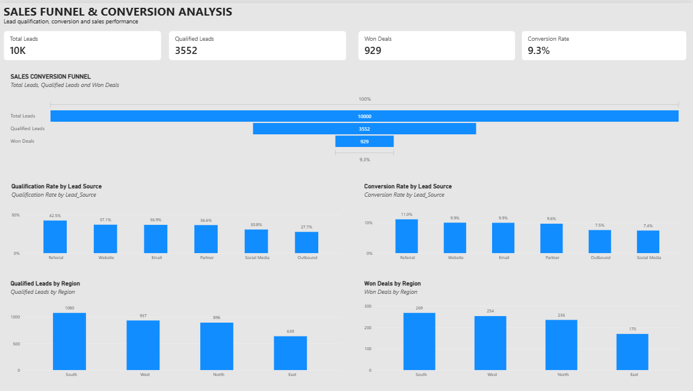
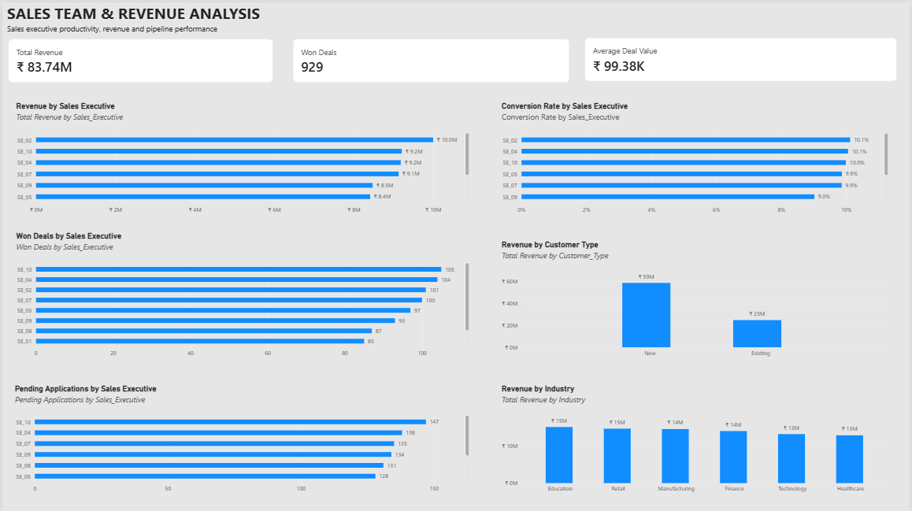

# CRM & Sales Analytics Dashboard

## 📌 Project Overview

An interactive **Power BI analytics project** designed to analyze CRM leads, sales funnel performance, sales team productivity, revenue generation, and customer segments.

The project transforms CRM and sales data into actionable business insights through KPI analysis, funnel analysis, trend analysis, segmentation, and interactive Power BI dashboards.

---

## 🎯 Business Objectives

- Monitor overall lead and sales performance
- Analyze lead qualification and conversion rates
- Identify high-performing lead sources and regions
- Evaluate sales executive productivity
- Analyze revenue and won-deal performance
- Understand customer and industry revenue contribution
- Identify areas for improving the sales pipeline
- Support data-driven sales and CRM decision-making

---

## 🛠️ Tools & Technologies

- **Microsoft Power BI**
- **Power Query**
- **DAX**
- **Data Visualization**
- **Business Intelligence**
- **CRM & Sales Analytics**

---

## 📊 Dashboard Analysis

### 1. CRM Executive Overview

Provides a high-level view of CRM and sales performance.

**Key analysis areas:**

- Total Leads
- Qualified Leads
- Won Deals
- Total Revenue
- Monthly Lead Trends
- Monthly Revenue Trends
- Lead Source Performance
- Regional Performance
- Product Performance

---

### 2. Sales Funnel & Conversion Analysis

Analyzes the movement of leads through the sales funnel and identifies conversion patterns.

**Key analysis areas:**

- Total Leads
- Qualified Leads
- Won Deals
- Qualification Rate
- Overall Conversion Rate
- Qualification Rate by Lead Source
- Conversion Rate by Lead Source
- Qualified Leads by Region
- Won Deals by Region

---

### 3. Sales Team & Revenue Analysis

Evaluates sales executive performance and revenue contribution.

**Key analysis areas:**

- Revenue by Sales Executive
- Conversion Rate by Sales Executive
- Won Deals by Sales Executive
- Pending Applications by Sales Executive
- Revenue by Customer Type
- Revenue by Industry
- Average Deal Value

---

## 💡 Key Business Insights

The analysis highlights several important sales and CRM patterns:

- The overall sales funnel generated **10K leads**, with **3,552 qualified leads** and **929 won deals**.
- The overall lead-to-deal conversion rate is approximately **9.3%**.
- **Referral** leads demonstrate strong qualification and conversion performance among the analyzed lead sources.
- The **South region** has the highest lead volume among the analyzed regions.
- **CRM Platform** is the leading product by lead volume.
- Revenue performance varies across sales executives, highlighting differences in individual productivity.
- **New customers** contribute a larger share of total revenue compared with existing customers.
- Industry-level analysis shows notable revenue contribution across sectors such as **Education, Retail, Manufacturing, Finance, Technology, and Healthcare**.
- The dashboard can help sales teams identify stronger lead sources, regional opportunities, and areas where funnel conversion can be improved.

Detailed observations and recommendations are available in:

`insights/CRM_Sales_Insights.md`

---

## 📈 Key KPIs

| KPI | Value |
|---|---:|
| Total Leads | 10,000 |
| Qualified Leads | 3,552 |
| Won Deals | 929 |
| Conversion Rate | 9.3% |
| Total Revenue | ₹83.74M |
| Average Deal Value | ₹99.38K |

---

## 🔍 Key Skills Demonstrated

- Data Cleaning & Transformation
- Power Query
- Data Modeling
- DAX Calculations
- KPI Development
- Sales Funnel Analysis
- Lead Conversion Analysis
- CRM Performance Analysis
- Sales Team Performance Analysis
- Revenue Analysis
- Business Segmentation
- Interactive Dashboard Development
- Data Visualization
- Business Insight Generation

---

## 📂 Project Structure

```text
02-crm-sales-analytics/
│
├── CRM_Sales_Analytics.pbix
├── README.md
│
├── screenshots/
│   ├── 01_CRM_Executive_Overview.png
│   ├── 02_Sales_Funnel_Analysis.png
│   └── 03_Sales_Team_Revenue_Analysis.png
│
└── insights/
    └── CRM_Sales_Insights.md
```

---

## 📷 Dashboard Preview

### CRM Executive Overview



### Sales Funnel & Conversion Analysis



### Sales Team & Revenue Analysis



---

## 📁 Project Files

- **`CRM_Sales_Analytics.pbix`** — Interactive Power BI dashboard
- **`screenshots/`** — Dashboard screenshots and previews
- **`insights/CRM_Sales_Insights.md`** — Detailed business insights and recommendations
- **`README.md`** — Project documentation

---

## 👩‍💻 Author

**Meghana P**

Business & Data Analytics | Power BI | SQL | Excel | Tableau
