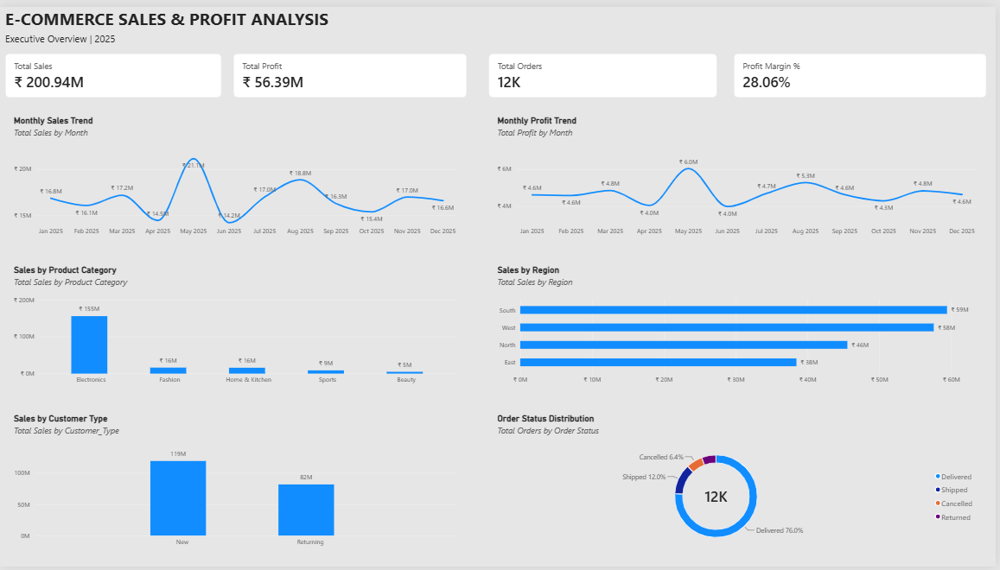
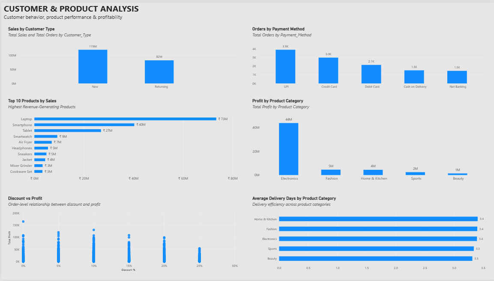
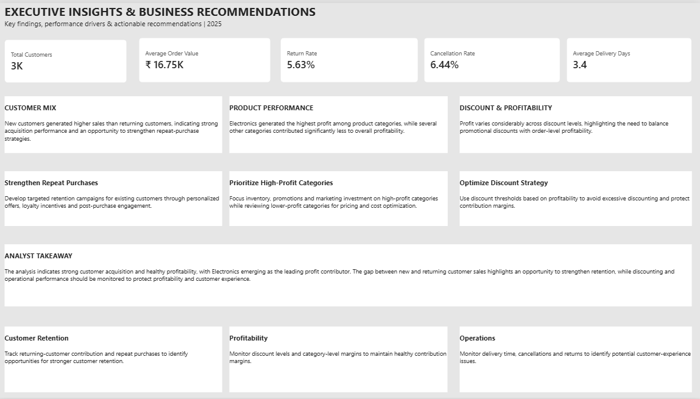

# E-commerce Customer & Revenue Analytics Dashboard

## 📌 Project Overview

An interactive **Power BI analytics project** designed to analyze e-commerce sales performance, customer purchasing behavior, product performance, and revenue trends.

The project transforms transactional data into meaningful business insights through KPI analysis, customer and product segmentation, trend analysis, and interactive dashboard reporting.

---

## 🎯 Business Objectives

- Monitor overall sales and revenue performance
- Analyze order and revenue trends over time
- Understand customer purchasing behavior
- Identify performance differences across products and categories
- Compare performance across relevant customer and product segments
- Support data-driven business decision-making

---

## 🛠️ Tools & Technologies

- **Microsoft Power BI**
- **Power Query**
- **DAX**
- **Data Visualization**
- **Business Intelligence**

---

## 📊 Analysis Areas

- Sales & Revenue Analysis
- Order Trend Analysis
- Customer Analysis
- Product Performance
- Category Performance
- Customer Segmentation
- KPI Monitoring
- Trend Analysis

---

## 📈 Dashboard Structure

The Power BI dashboard provides an interactive view of e-commerce performance across multiple business dimensions.

### 1. Executive Overview

Provides a high-level view of overall e-commerce performance.

**Analysis includes:**

- Sales and Revenue KPIs
- Order Performance
- Revenue Trends
- Category Performance
- Product Performance

---

### 2. Customer & Product Analysis

Focuses on customer purchasing behavior and product-level performance.

**Analysis includes:**

- Customer Purchasing Behavior
- Customer Segmentation
- Product Performance
- Category Performance
- Customer and Product Metrics

---

### 3. Performance Analysis

Provides a broader view of business performance across different dimensions.

**Analysis includes:**

- Revenue Trends
- Order Trends
- Performance Comparisons
- Key Performance Indicators
- Segment-Level Analysis

---

## 💡 Key Business Insights

The analysis provides a structured view of e-commerce performance across customers, products, categories, orders, and revenue.

Key areas of analysis include:

- Revenue and order trends over time
- Customer purchasing behavior and revenue contribution
- Product-level performance
- Category-level performance
- Customer segmentation
- Revenue and order performance across business segments
- Identification of higher- and lower-performing products and segments

Detailed observations and recommendations are available in:

`insights/Ecommerce_Insights.md`

---

## 📌 Business Recommendations

- Monitor high-value customer segments and develop targeted retention strategies.
- Track high-performing products and categories to understand their contribution to revenue.
- Investigate products or segments with relatively lower performance for potential improvement opportunities.
- Regularly monitor revenue and order trends to identify changes in customer demand.
- Use customer and product segmentation to support more focused business decisions.

---

## 🔍 Data Preparation

The dataset was prepared for analysis using **Power Query**.

Key data preparation steps included:

- Source data validation
- Data type verification
- Missing-value and blank-value checks
- Duplicate and data-quality checks
- Category and field standardization
- Revenue calculation validation
- Data modeling for Power BI analysis

---

## 🧠 Skills Demonstrated

- Data Cleaning & Transformation
- Power Query
- Data Modeling
- DAX Calculations
- KPI Development
- Customer Analysis
- Product Analysis
- Revenue Analysis
- Sales Analytics
- Trend Analysis
- Data Visualization
- Interactive Dashboard Development
- Business Insight Generation

---

## 📂 Project Structure

```text
03-ecommerce-analytics/
│
├── Project_3_Ecommerce_Analytics.pbix
├── README.md
│
├── screenshots/
│   ├── 01_Ecommerce_Executive_Overview.png
│   ├── 02_Customer_Product_Analysis.png
│   └── 03_Performance_Analysis.png
│
└── insights/
    └── Ecommerce_Insights.md
```

---

## 📷 Dashboard Preview

### Executive Overview



### Customer & Product Analysis



### Performance Analysis



---

## 📁 Project Files

- **`Project_3_Ecommerce_Analytics.pbix`** — Interactive Power BI dashboard
- **`screenshots/`** — Dashboard screenshots and previews
- **`insights/Ecommerce_Insights.md`** — Detailed business insights and recommendations
- **`README.md`** — Project documentation

---

## 👩‍💻 Author

**Meghana P**

Business & Data Analytics | Power BI | SQL | Excel | Tableau
